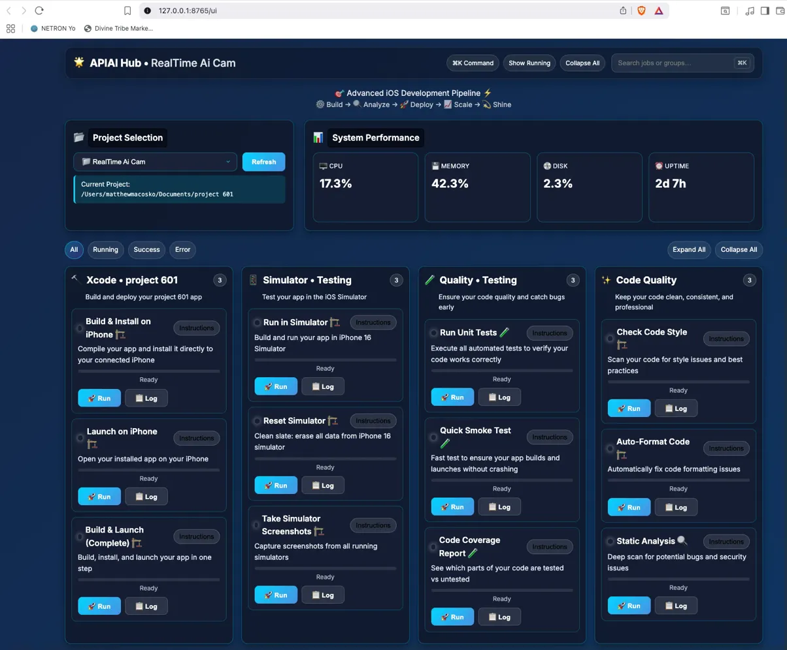

# 🚀 APIAI Hub

A professional FastAPI-powered development automation server for iOS development. Built to streamline Xcode workflows, automate builds, and provide remote development control through a clean web interface.

**In one sentence:** it runs on your Mac, finds your Xcode project, and gives you a web dashboard of one-click jobs (build, install, launch, test, archive, git, diagnostics) that run `xcodebuild`, `xcrun` and `git` for you and log the output.



*The dashboard, served at `/ui`.*

## 👤 What I built

Written by Matt Macosko. Everything below is in this repo:

- **The server and job engine** - [`app/server.py`](app/server.py): FastAPI routes, the API key guard, async job runner that streams output to `logs/<job>.log`, and a sync runner with a 300 second timeout.
- **Xcode project auto-detection** - `ProjectConfig` in [`app/server.py`](app/server.py) finds the `.xcodeproj`, then reads the scheme, target and bundle ID from `xcodebuild -list` and `xcodebuild -showBuildSettings`.
- **Dynamic job catalog** - `generate_dynamic_jobs()` in [`app/server.py`](app/server.py) builds 8 job groups for whichever project is selected.
- **Project switcher** - `/projects` and `/set-project` in [`app/server.py`](app/server.py) scan the Documents folder for Xcode projects and regenerate the jobs.
- **Web dashboard** - [`app/static/dashboard.html`](app/static/dashboard.html): project picker, job cards, log viewer, stats refreshed every 15 seconds.
- **Dev launcher** - [`bin/dev.sh`](bin/dev.sh): loads `.env` and starts Uvicorn with reload.
- **A modular split (not wired in yet)** - [`app/api/`](app/api), [`app/config/`](app/config), [`app/jobs/`](app/jobs), [`app/utils/`](app/utils). See Known limits.

Upstream tools it is built on: [FastAPI](https://github.com/fastapi/fastapi), [Uvicorn](https://github.com/encode/uvicorn), [Pydantic](https://github.com/pydantic/pydantic), psutil and python-dotenv, plus Apple's `xcodebuild`, `xcrun devicectl` and `xcrun simctl`. See [CREDITS.md](CREDITS.md).

## ✨ Features

- **🔨 Automated iOS Builds** - Build and install apps directly to connected devices
- **📱 Remote App Launch** - Launch installed apps on iPhone remotely
- **📊 System Monitoring** - Real-time CPU, memory, and disk usage stats
- **🔐 Secure API** - API key authentication with localhost bypass
- **📋 Job Management** - Organized development tasks with detailed logging
- **🎯 Professional Dashboard** - Clean web interface for all operations

## 🏗️ Architecture

```
apiai-hub/
├── app/
│   ├── server.py          # Main FastAPI server (all live routes and jobs)
│   ├── config/            # Configuration (modular split, not imported yet)
│   ├── api/               # Endpoints (modular split, not imported yet)
│   ├── jobs/              # Job definitions and executor (not imported yet)
│   ├── utils/             # System utilities (not imported yet)
│   └── static/            # Web dashboard
├── bin/                   # Development scripts
├── logs/                  # Execution logs (created on first run)
└── scripts/               # Job scripts
```

## 🚀 Quick Start

### Prerequisites
- macOS (jobs call `xcodebuild`, `xcrun` and `/bin/zsh`)
- Python 3.13+
- Xcode (for iOS development features)
- Connected iPhone (for device builds)

### Installation

1. **Clone the repository**
```bash
git clone https://github.com/nicedreamzapp/apiai-hub.git
cd apiai-hub
```

2. **Set up virtual environment**
```bash
python -m venv .venv
source .venv/bin/activate
```

3. **Install dependencies**
```bash
pip install -r requirements.txt
```

4. **Configure environment** (there is no `.env.example`, so create `.env` yourself)
```bash
echo "MINI_API_KEY=choose-a-long-random-key" > .env
```

5. **Point it at your machine.** Edit [`app/server.py`](app/server.py): the `/Users/matthewmacosko/Documents` search path in `get_available_projects()`, the default `current_project`, and the iPhone device ID in the device jobs are hardcoded to the author's Mac.

6. **Run the server**
```bash
./bin/dev.sh
```
(`run.sh` only activates the virtualenv; it does not start the server.)

Visit `http://127.0.0.1:8765/ui` to access the dashboard. The root URL `/` returns 404.

## 🔧 Configuration

### Environment Variables

| Variable | Description | Default |
|----------|-------------|---------|
| `MINI_API_KEY` | API key for non-localhost requests | Empty (remote calls are rejected) |
| `HOST` | Server host address (used by `bin/dev.sh`) | `127.0.0.1` |
| `PORT` | Server port (used by `bin/dev.sh`) | `8765` |

## 📡 API Endpoints

```http
GET  /ui                  # Web dashboard
GET  /health              # Health check
GET  /stats               # CPU, memory, disk, uptime
GET  /projects            # Xcode projects found + current project
POST /set-project         # {"project_path": "..."} switch project
GET  /jobs                # Job groups for the current project
POST /run                 # {"job_name": "..."} run in background, log to logs/
POST /run_sync            # {"job_name": "..."} run and return output
GET  /logs/{job_name}     # Last 200 lines of a job's log
```

### Authentication

- **API Key**: Required for remote access via `X-API-Key` header
- **Localhost**: Requests from `127.0.0.1` / `::1` skip the key check
- **Dashboard**: does not send the key, so it only works from localhost

## 🎯 Job System

Jobs are generated per project in `generate_dynamic_jobs()` and grouped as:

- **Xcode • <your target>** - Build & Install on iPhone, Launch on iPhone, Build & Launch
- **Simulator • Testing** - Run in Simulator, Reset Simulator, Screenshots
- **Quality • Testing** - Unit tests, smoke test, code coverage
- **Code Quality** - Style check, auto-format, static analysis
- **Version Control** - Status, push, feature branch, commit all
- **App Store • Release** - Archive, export, increment version, validate
- **System Diagnostics** - Devices, environment, storage, performance, network
- **Maintenance** - Clean caches and builds, tool updates, downloads cleanup

If no `.xcodeproj` is found, `/jobs` returns a single "No Project Found" group.

## 📊 Monitoring

Real-time system metrics:
- CPU usage percentage
- Memory utilization
- Disk space tracking
- System uptime

## 🔨 Development

### Adding New Jobs

Add an entry to a group inside `generate_dynamic_jobs()` in [`app/server.py`](app/server.py):
```python
"new_job_id": {
    "name": "Job Name",
    "description": "What this job does",
    "instruction": "Shown in the dashboard",
    "cmd": "shell command to execute"
}
```

It appears in the dashboard on the next `/jobs` refresh. (Editing `app/jobs/definitions.py` has no effect today.)

### Custom Scripts

Place executable scripts in `scripts/` directory for complex workflows and call them from a job's `cmd`. [`scripts/sample_job.sh`](scripts/sample_job.sh) is an example.

## 📝 Logging

Each `/run` job writes `logs/<job_name>.log` (overwritten per run) with:
- Start and completion timestamps
- The command that ran
- Combined stdout and stderr
- Exit code and success/failure status

## 🛠️ Tech Stack

- **Backend**: FastAPI + Uvicorn
- **Authentication**: API key + localhost bypass
- **System**: psutil for monitoring
- **Frontend**: HTML/CSS/JavaScript dashboard
- **iOS**: Xcode command line tools

## 🔒 Security

- Environment-based API key storage (`.env` is gitignored)
- Localhost development bypass
- The API only runs jobs by ID from the server's own list, not arbitrary commands
- Commands run through a shell, and the project path from `/set-project` is inserted into them, so do not expose this server to untrusted networks

## ⚠️ Known limits

- macOS only, and paths plus the iPhone device ID are hardcoded to the author's machine (see Quick Start step 5).
- Simulator jobs target `iPhone 16`, iOS 18.6.
- `app/api`, `app/config`, `app/jobs` and `app/utils` are a started refactor that `server.py` does not import; `app/jobs_data.py` is an empty leftover.
- No automated tests yet.

## 📄 License

MIT License - see LICENSE file for details.

## 🤝 Contributing

1. Fork the repository
2. Create feature branch
3. Make your changes
4. Add tests if applicable
5. Submit pull request

## 📞 Support

For questions or issues:
- Open GitHub issue
- Check logs in `logs/` directory
- Verify environment configuration

---

**Built for professional iOS development workflows** 🍎
